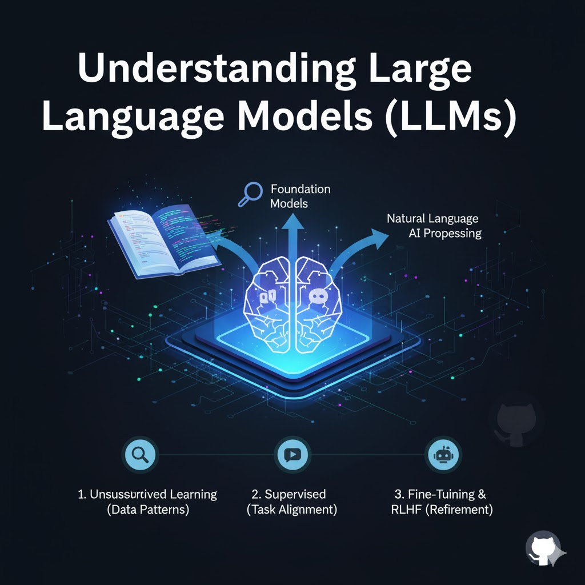

# Introduction to LLM and RAG

# Understanding Large Language Models (LLMs)

This document provides a quick overview of **Large Language Models (LLMs)**, starting with the foundational concept that makes them possible.

## 🧠 Foundation Models (FMs): The Building Blocks

**Foundation Models (FMs)** are massive neural networks trained on huge amounts of general data. Their size and training allow them to serve as a **foundation** for a wide range of tasks and applications.

- **The Big Advantage:** Once you have a foundation model (like **GPT-3** for language), you don't need to train a brand new, massive model every time you have a new task. You can simply adapt the existing FM.
- **Core Role:** FMs excel at tasks like processing, understanding, and generating human-like text.

---

## 💻 What are LLMs?

LLMs are a specific type of foundation model focused on language. They are trained on a truly **vast corpus of text data** from books and articles to conversations often running into **petabytes** of information.

LLM training typically happens in distinct phases:

### Phase 1: Unsupervised Learning (The Raw Learner)

The model is fed massive amounts of data _without_ any labels or human guidance.

- **Goal:** The model learns to identify **patterns and relationships** within the data purely by observation.
- **Alignment:** In this stage, the model isn't "aligned" with human intent. If you ask, "Hey, what's up?", it's likely to give a simple, conversational reply like, "What's up, with you?". It just mimics common patterns.

### Phase 2: Supervised Learning (The Goal-Oriented Learner)

The model is further trained using **labeled data** with clear objectives.

- **Goal:** The model adjusts its internal parameters (weights) to perform specific tasks reliably, such as language translation or text classification.
- **Result:** The model begins to **align** with a user's intent. Now, when you ask it to classify the sentiment of a sentence, it can do so accurately.

### Phase 3: Fine-Tuning and Reinforcement Learning (The Refiner)

This final stage involves advanced techniques to make the model's output truly useful and reliable for end-users.

1. **Supervised Instruction Fine-Tuning (SFT):** The model is trained on specific, labeled datasets that are designed to teach it to follow instructions better and reduce errors in its predictions. This can be done for specific domains or types of tasks.
2. **Reinforcement Learning from Human Feedback (RLHF):** This is the ultimate refinement step, acting like a **reward system**.
   - **How it Works:** Humans rate the quality of the model's output or provide modifications.
   - **Effect:** Based on this feedback, the model continues to adjust itself to better match what humans consider a "good" or desirable response.
   - **Example:** If you've ever used a chatbot like ChatGPT or Gemini and been prompted to rate a response or select a better one from a list, you've participated in this interactive feedback mechanism!

# ⚠️ Core Challenges and Limitations of LLMs

While incredibly powerful, Large Language Models are not perfect. Understanding their core challenges is essential for effective use.

## 1. Hallucination (or Confabulation)

This is perhaps the most widely discussed issue. **Hallucination** refers to the model generating plausible-sounding but factually **incorrect or entirely fabricated** information.

- **What It Is:** The model is not a reasoning engine; it's trained to predict the most statistically likely next word. When its training data is insufficient, of low quality, or when it tries to fill gaps, it _invents_ answers.
- **The Root Cause:** LLMs fundamentally lack "common sense." They prioritize fluency and coherence over factual accuracy.
- **The Takeaway:** **Always double-check** critical information provided by an LLM.

### Key Factors that Contribute to Hallucination:

| **Factor**          | **Description**                                                                                                                                                                                     |
| ------------------------- | --------------------------------------------------------------------------------------------------------------------------------------------------------------------------------------------------------- |
| **Lack of Context** | If the user's prompt is too vague, the model has to guess the intent. E.g., asking "What's the capital?" without specifying the country forces the model to choose a likely but potentially wrong answer. |
| **Data Quality**    | Deteriorating or conflicting data in the training set can amplify the chances of the model generating erroneous results.                                                                                  |

## 2. 🗓️ Knowledge Cut-off Date

LLMs are trained on fixed datasets, giving them a **specific knowledge cut-off date**.

- **Impact:** They **do not have access** to information or events that occurred after this date. If you ask about a recent event, the model won't know the answer and may explicitly state its limitations.
- **The RAG Solution:** This is the problem that **Retrieval Augmented Generation (RAG)** is designed to solve. RAG allows the LLM to access and integrate **up-to-date, external information** (like databases or real-time search results) before generating a response, effectively bypassing the knowledge cut-off limitation.

---

## 3. ⚠️ Ethical Risks

### Ethical and Societal Risks

| **Challenge**            | **Description**                                                                                                                                                                                                |
| ------------------------------ | -------------------------------------------------------------------------------------------------------------------------------------------------------------------------------------------------------------------- |
| **Inherent Bias**        | LLMs can perpetuate and amplify existing societal biases (gender, race, ethnicity, etc.) because these biases are**present in their massive training data**. This leads to unfair or discriminatory outputs.   |
| **Lack of Transparency** | It's incredibly difficult to trace**why** an LLM produced a specific output (the "Black Box" problem). This makes it hard to identify the root source of bias or error and lowers user trust.                  |
| **Violation of Privacy** | Due to the massive scale of training data (often scraped from the public web), LLMs might inadvertently**memorize and output confidential or personal information** (like names, addresses, or phone numbers). |
|                                |                                                                                                                                                                                                                      |

# 🔍 Retrieval Augmented Generation (RAG)

**RAG (Retrieval Augmented Generation)** is a method designed to overcome the core limitation of LLMs: their static **knowledge cut-off date**.

RAG enhances the LLM's capability by allowing it to access and utilize up-to-date, external knowledge before generating a response.

## How RAG Works

Instead of relying solely on its static training data, a RAG system performs the following steps:

1. **Retrieval:** When a user asks a question, the system first retrieves **contextually relevant information** from an external knowledge.
2. **Augmentation:** This retrieved information is then used to **augment** (enrich) the user's original prompt.
3. **Generation:** The LLM receives the enriched prompt and uses the new context to generate a more accurate, current, and grounded response.

Essentially, the LLM "talks" to an external database to get up-to-date, contextual, and specific information.6

---

## Key Benefits of Using RAG

| **Benefit**                  | **Description**                                                                                                                                         |
| ---------------------------------- | ------------------------------------------------------------------------------------------------------------------------------------------------------------- |
| **Avoids Stale Information** | LLMs can access and incorporate the**latest information** by querying updated external databases, bypassing the LLM's knowledge cut-off.                |
| **Customization**            | Allows for the inclusion of**domain-specific, proprietary, or private knowledge**, enabling tailored responses for a specific organization or use case. |
| **Attribution/Traceability** | Generated text can often be**linked directly back to its source** in the external database, increasing user trust and making fact-checking easier.      |
| **Control**                  | Provides more**control** over the type and amount of information the model is allowed to output, helping to mitigate certain types of hallucinations.   |

## Common External Sources for RAGs

RAG systems are flexible and can be connected to various external data sources:

- **Document-Based Sources:** Books, articles, research papers, and specialized databases.
- **Structured Data:** Database entries, tables, and other structured sources.
- **Knowledge Graphs:** Proprietary graphs that map out complex semantic relationships.
- **Mixed Media Sources:** Any combination of text, images, or other data formats.

# 🛠️ Understanding a Simple RAG System (First Steps)

A Retrieval Augmented Generation (RAG) system has several distinct stages that link the LLM to a source of external knowledge.

## 1. Encoding and Vector Embeddings: The Knowledge Base

The first critical step involves preparing the external knowledge for retrieval through a process called **vector embedding**.

- **The Encoder:** An "encoder" model converts raw text (documents, articles, etc.) into a mathematical format known as **vector embeddings**.
- **Vector Function:** These vectors are numerical representations that capture the **semantics** (meaning) of words, their relationships, and the overall topic.
  - **Crucial Concept:** Words and documents with **similar meanings** will have **similar vector embeddings** (they will be mathematically "close" to each other).
- **Storage:** These vectors are stored in a specialized **vector database**. Crucially, the system also stores a **reference** (like a URL or database ID) to the original source text or document alongside each vector.

### 💡 Why Vector Embeddings are Important (Dimensional Reduction)

Vector embeddings involve **dimensional reduction**, meaning they retain only the essential semantic features of the text. Because of this transformation, it is **not possible** to convert a vector embedding back to the original text directly; its value is in its representation of meaning.

## 2. The Query Process: Turning a Question into a Vector

When a user submits a question (e.g., "What is the population of Paris, France?"), the system prepares that query for comparison.

- **Query Encoding:** The user's prompt is **first encoded** using the **exact same encoder model** that was used to create the external document vectors.
- **Output:** The result is a **query vector** that represents the semantic meaning of the user's question.

## 3. The Retrieval Step: Finding Relevant Context

This is where the "Retrieval" part of RAG occurs.

- **Matching:** The query vector is matched against the entire vector database to find the **most similar document vectors**.
- **Goal:** To retrieve the document(s) that are most contextually relevant to the user's question. These documents become the **context** for the LLM.

## 4. The Generation Step: Creating the Answer

The final step leverages the LLM's language skills with the newly retrieved, accurate information.

1. **Combined Input:** The original user query and the retrieved context (the relevant document text) are combined into a single, comprehensive prompt.
2. **LLM Generation:** This combined input is fed into the LLM. The LLM then uses this fresh, external information to generate an accurate and grounded answer.
   - **Example:** For the "Paris population" question, if a recent census report is found, the LLM uses that to answer ("approximately 2.2 million people").
3. **Verification:** The system can also provide a **link to the source document** for verification, ensuring accuracy and building user trust.
